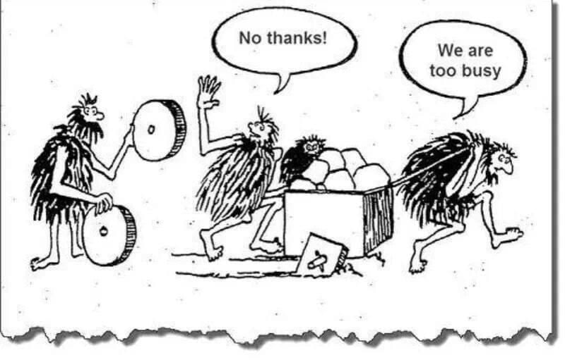
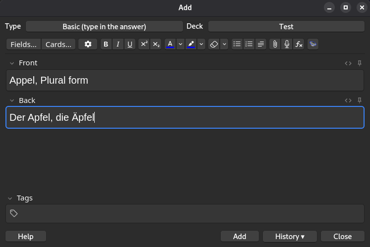
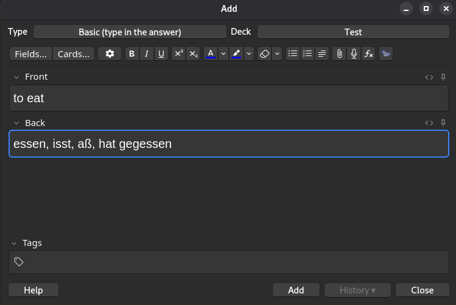
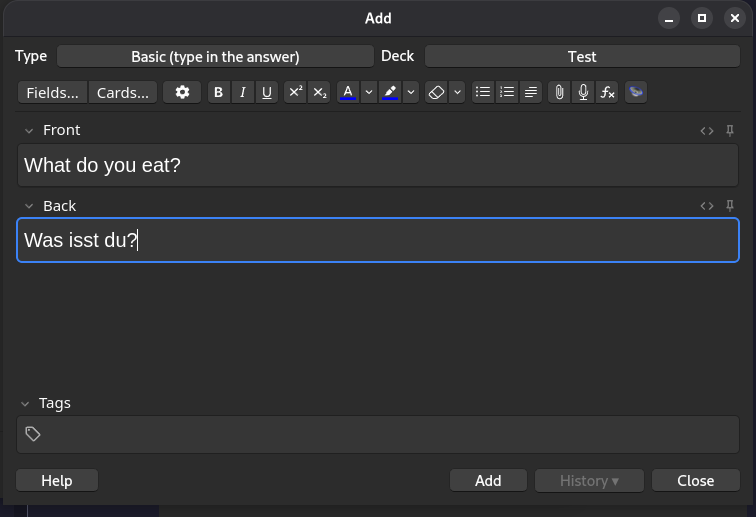
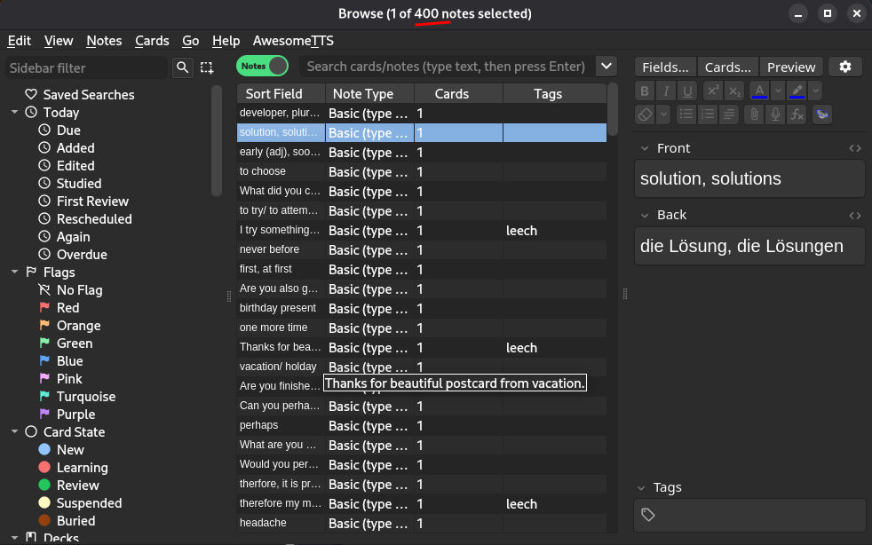

# How I Learn Deutsch

Here's how I've structured my German learning — the routine, the problems I ran into, and the system I built to fix them.

## My daily routine

Every day, I spend the first hour after waking up on German. On top of that, I have a private lesson with my teacher every other day.

## The problem: reviewing isn't the same as mastering

After each lesson, I knew I was supposed to review the material. But that raised a question: is reviewing actually enough?

Reading through my notes and seeing that "der" becomes "den" in the accusative case for masculine nouns felt like progress. But there's a real difference between _reading about_ a rule and actually knowing or better mastering it.

To close that gap, I needed real practice, not just review, something that would train my memory and get me used to thinking in German, not just recognizing rules on a page.

### Isn't reviewing already a form of practice?

To some extent, yes. But here's the catch.

Picture this: you wake up, sit down with your notes, and start reviewing. You read a sentence out loud, then pause, what should I do next? Quiz myself? Look something up? Try to build a new sentence? You start improvising, searching dictionaries, hunting for tricks online.

That constant decision-making is exhausting. More often than not, you end up spending your energy figuring out _what to do_ instead of actually _doing it_ practicing the language itself. The session turns into research, not practice, and it ends in frustration.

## Was I the only one? No, so 100% there's a solution

This is a common problem, and once I recognized it, I looked for a system rather than trying to solve it fresh every morning.

## My solution: Have a framework, so your mind doesn't think of other steps every day(frustrating)..

I use [Anki](https://apps.ankiweb.net/), a simple flashcard app built for spaced repetition. The app itself is minimal — the real value comes from _how_ you use it.

Here's the workflow. Say my teacher uses a new sentence with a verb I don't know yet:

> `Was isst du?`

## My setup

- **Browser:** Brave, because it blocks ads and keeps a separate, clean browsing history — no mixing German study with everything else I search or watch.
- **Flashcards:** Anki
- **Dictionaries:** [Leo](https://dict.leo.org/german-english/) and [B-Amooz](https://dic.b-amooz.com/de/dictionary/) (if you know a better one, let me know!)

## How I add a new word

**Nouns**

1. Look it up in the dictionary: check the definition, listen to the pronunciation, and note the article (der/die/das) and both forms (singular and plural).
2. Build the flashcard:
   - **Front:** English meaning + plural form (e.g., "apple," plural)
   - **Back:** Singular form with article, plural form with article (e.g., "die Äpfel")

**Verbs**

1. Look it up: definition, pronunciation, and conjugations (e.g., _esse, isst_).
2. Add it to Anki using the "type in the answer" card type.
3. Build the flashcard:
   - **Front:** English meaning (e.g., "to eat")
   - **Back:** Infinitive, 3rd person present (_isst_), 3rd person Präteritum (_aß_), 3rd person Perfekt (_hat gegessen_)

**Last step:** I add the original sentence the word appeared in, or another one I find interesting, as its own card.

## Why the 3rd person form?

German verbs are regular (weak or strong) or irregular. What matters is this: irregular verbs almost always reveal their stem changes in the **2nd person (du)** and **3rd person (er/sie/es)** forms.

Learning the 3rd person singular first means you see the irregularity right away. Once that form is solid, the rest of the conjugation falls into place much faster and with practice, it becomes automatic.

### Example: present tense of _essen_ (to eat)

| Person    | Form         | Person  | Form      |
| :-------- | :----------- | :------ | :-------- |
| ich       | ess**e**     | wir     | ess**en** |
| du        | **i**ss**t** | ihr     | ess**t**  |
| er/sie/es | **i**ss**t** | sie/Sie | ess**en** |

## The result:

- Whatever strategy you use, you don't have to follow my step, just take the parts that you think it is good for you. Start simple making and then you would probably have a good mindset and framework.

- I'm using this strategy, for more than 3 months it is getting better every time.

- I'm not frustrated and know what steps I do each day, start with Anki, review the notes..

- You also can have this overview:

- - 
